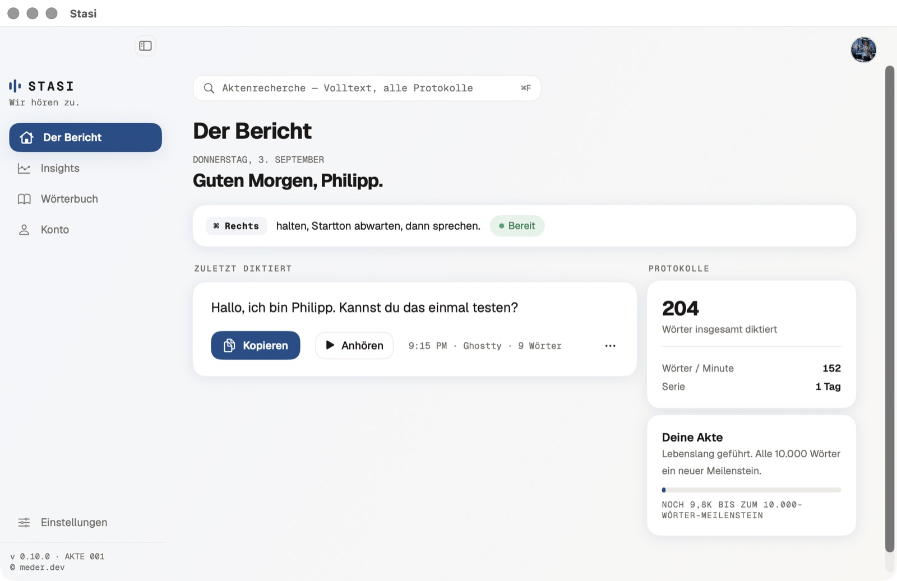
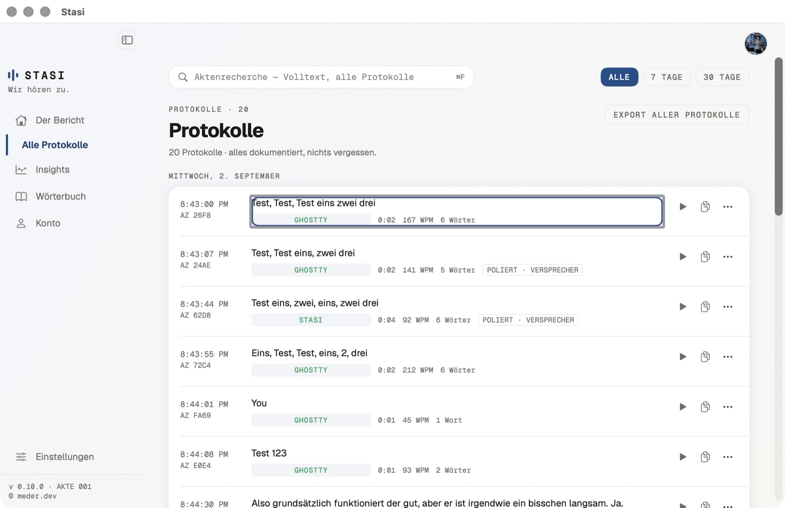
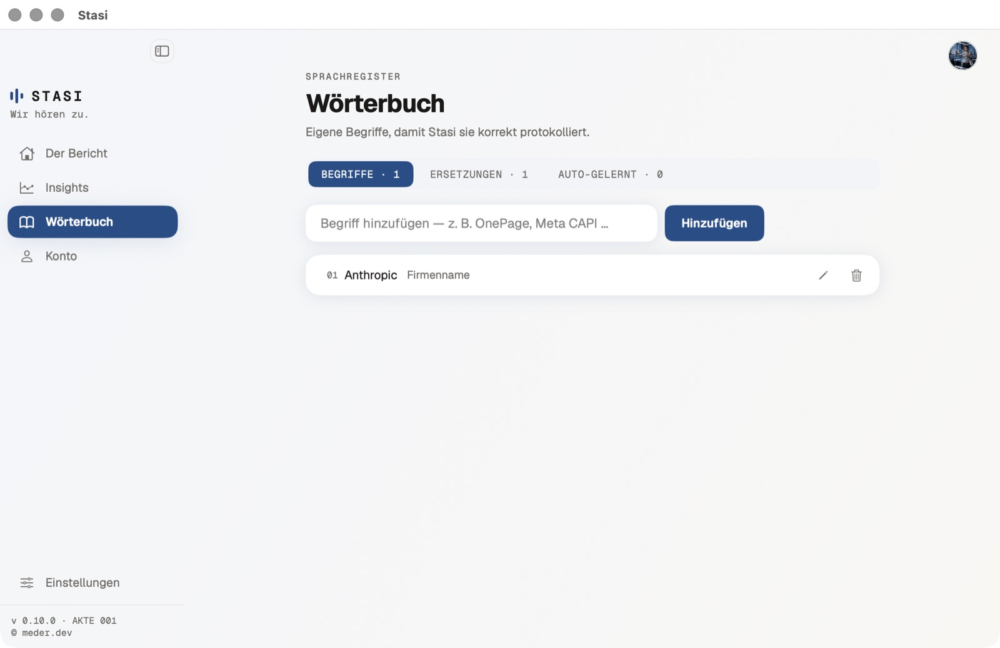
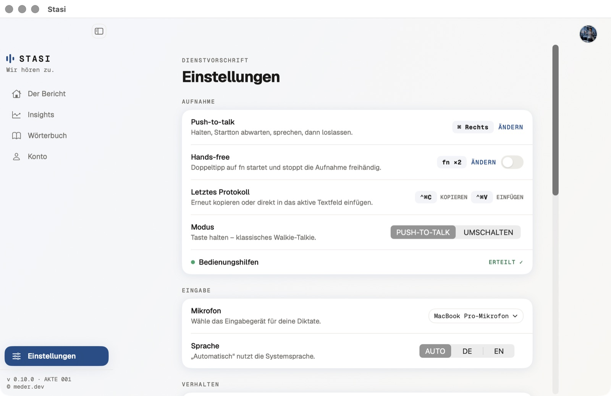
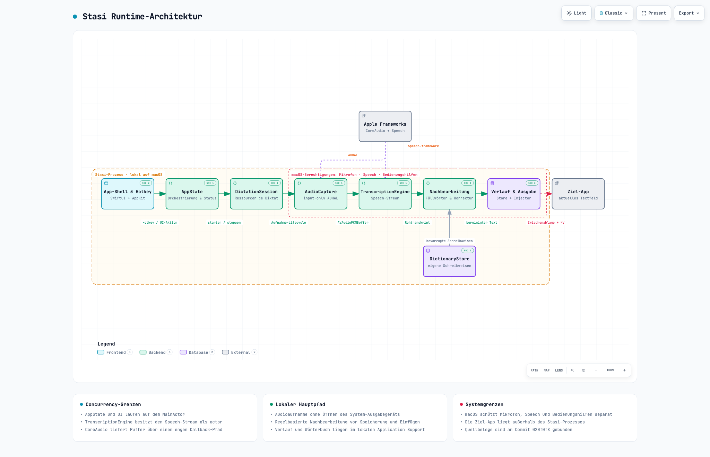

# STASI

Push-to-Talk-Diktat für macOS – Wispr-Flow-Style, komplett on-device.

Standardmäßig die **rechte Command-Taste halten** → Startton abwarten → sprechen →
loslassen. Der Push-to-talk-Shortcut lässt sich in den Einstellungen frei belegen.
Der korrigierte Text wird in die fokussierte App getippt.

## Screenshots

| Der Bericht | Protokolle |
|---|---|
|  |  |

| Insights | Wörterbuch | Einstellungen |
|---|---|---|
|  |  |  |

## Voraussetzungen

- Apple Silicon
- macOS 26 oder neuer
- Für die Installation über Homebrew: Homebrew

## Installation

### Homebrew (empfohlen)

```bash
brew install --cask mm20261/tap/stasi
```

Der Cask entfernt nach der Installation das Quarantäne-Attribut, damit die nicht
notarisierte App direkt startet. Homebrew 6 kennt `--no-quarantine` nicht mehr.

### GitHub-Release als ZIP

1. Das aktuelle ZIP unter
   [github.com/mm20261/stasi/releases/latest](https://github.com/mm20261/stasi/releases/latest)
   laden und `Stasi.app` nach `/Applications` ziehen.
2. Einmal versuchen, Stasi zu öffnen. macOS blockiert den ersten Start, weil Apple
   die App nicht überprüfen kann.
3. **Systemeinstellungen → Datenschutz & Sicherheit** öffnen und unten
   **Trotzdem öffnen** wählen. Rechtsklick → Öffnen reicht seit macOS 15 nicht mehr.

Alternativ lässt sich das Quarantäne-Attribut im Terminal entfernen:

```bash
xattr -dr com.apple.quarantine /Applications/Stasi.app
```

> **Warum die Warnung?** Stasi ist nicht notarisiert, weil für diesen Release kein
> bezahlter Apple-Developer-Account zur Verfügung steht. Die App wurde daher nicht
> von Apple geprüft; der vollständige Quellcode ist offen und kann stattdessen selbst
> gebaut werden.

### Aus dem Quellcode bauen

Der lokale Build benötigt eine macOS-26-Toolchain mit Unterstützung für Swift Tools
6.2. Er ist weder mit Hardened Runtime gebaut noch notarisiert und deshalb nicht zur
Weitergabe bestimmt.

```bash
./scripts/make-app.sh
open build/Stasi.app
```

Beim ersten Start fordert macOS die notwendigen Berechtigungen für Mikrofon und
Bedienungshilfen an. Diese Zustimmungen werden nicht durch Homebrew oder die App
umgangen.

## Aktualisieren

```bash
brew upgrade --cask stasi
```

Die integrierte Update-Prüfung informiert über neue GitHub Releases. Sie installiert
Updates bei einer Homebrew-Installation unter **Einstellungen → Über** direkt. Bei einer
ZIP-Installation führt sie weiterhin zur manuellen Download-Seite. Da die veröffentlichten
Builds nur ad-hoc signiert sind, fragt macOS die Berechtigungen für Mikrofon und
Bedienungshilfen nach jedem Update erneut ab.

## Deinstallieren

App entfernen und lokale Daten behalten:

```bash
brew uninstall --cask stasi
```

App einschließlich Verlauf, Wörterbuch und Einstellungen entfernen:

```bash
brew uninstall --cask --zap stasi
```

## Features

- **Echte Mac-App**: Dock-Icon, App-Menü, ⌘,-Settings, resizable Hauptfenster
- **On-device-Transkription** via macOS-26 `SpeechTranscriber` (EN/DE)
- **Oberfläche auf Deutsch und Englisch**, automatisch nach Systemsprache oder
  manuell in den Einstellungen wählbar
- **Deterministische Nachbearbeitung** mit den Stufen AUS und STANDARD:
  sprachspezifische Zögerlaute, Stotterer, konservative Selbstkorrekturen,
  Diskurs-Füller und Text-Hygiene – vollständig regelbasiert
- **Dictionary**: Wörter & Korrekturpaare (`cloud code` → `Claude Code`),
  inkl. Biasing der Engine + garantiertem Nachkorrektur-Pass
  - Datei: `~/Library/Application Support/Stasi/dictionary.json`
    (menschenlesbar, Hand-Edits erscheinen live in der UI)
- **Auto-gelernt**: Wiederholt diktierte unbekannte Begriffe werden vorgeschlagen und
  können übernommen oder dauerhaft ignoriert werden
- **Aufnahme-Pill** aus purem AppKit mit Pegel, zweizeiligem Live-Text und
  Phasenanzeige für Transkribieren, Polieren und Einfügen
- **Protokolle** mit Abspielen, Kopieren, Audio-/Text-/Markdown-Export,
  Rohtext-Ansicht, Korrektur- und Poliert-Nachweis
- **Globale Suche mit ⌘F** über alle Protokolle samt 7-/30-Tage-Filtern und
  Gesamtexport als Markdown
- **Dashboard und Insights** mit Wochenvergleich, App-Nutzung, Streak-Heatmap,
  Wortzahl, Diktiergeschwindigkeit und geschätzter Zeitersparnis
- **Onboarding** für Rechte, Hotkey, Modellvorbereitung und Probaufnahme
- **Aufbewahrung**: Nie, 1 Tag, 1 Woche, 2 Wochen oder 1 Monat; Audio wird mit gelöscht
- **Frei belegbares Push-to-talk**: rechte Command-Taste als Standard; alternativ
  Umschaltmodus „Drücken zum Starten, nochmal drücken zum Stoppen“
- **Globale Zusatz-Shortcuts**: ⌃⌘C kopiert und ⌃⌘V fügt das letzte Protokoll erneut ein
- **Hands-free** standardmäßig per Fn-Doppeltipp; frei wählbar sind fn sowie die
  linke oder rechte ⌘-, ⌥-, ⌃- oder ⇧-Taste
- **Update-Prüfung** über GitHub Releases mit direkter Homebrew-Installation oder
  manuellem Download-Link für ZIP-Installationen
- **Menüleisten-Status** mit explizit gecachten Symbolen je Verarbeitungsphase

## Design-System

Alle Views ziehen aus den Tokens in `Sources/Stasi/UI/Theme.swift`
(Farben, Typo, Raum, Motion) – Geist/Geist-Mono-Fonts, ausschließlich Light Mode
und 5 wählbare Akzent-Presets. Maßgebliche Vorschau:
`import/design_handoff_v3/preview.html` im Browser öffnen.

## Entwicklung

Für die normale Installation ist der oben beschriebene Homebrew-Cask vorgesehen.

```bash
swift build                    # Kompilieren
open Package.swift             # In Xcode öffnen
```

Tests (vor Commits muss die vollständige Suite laufen; Speech-Pipeline-E2E-Tests
bleiben ohne TCC-Consent gegatet):

```bash
swift build --build-tests
xcrun xctest "$(swift build --show-bin-path)/StasiPackageTests.xctest"
```

`swift test` kann in der Runner-Infrastruktur hängen; der direkte `xctest`-Aufruf ist
portabel, weil SwiftPM den aktuellen Binärpfad ermittelt und kein Architektur- oder
Konfigurationspfad fest verdrahtet ist.

## Erster Start – Berechtigungen

1. **Mikrofon** – Systemdialog beim ersten Aufnehmen bestätigen
2. **Bedienungshilfen** – für den globalen Hotkey und das Text-Einfügen;
   Settings (⌘,) → Berechtigungen → Link folgt zu System Settings

Stasi ist bewusst nicht sandboxed: Der globale Hotkey benötigt einen `CGEventTap`,
und das Einfügen in die jeweils fokussierte App erfolgt über synthetische
Tastaturereignisse. Beide Funktionen sind mit der App Sandbox nicht umsetzbar.

## Architektur

[](docs/architecture/README.md)

Die [geprüfte Runtime-Architektur](docs/architecture/README.md) zeigt den
Diktat-Hauptpfad, die Actor- und CoreAudio-Grenzen sowie revisionsgebundene
Quellbelege. Die [interaktive Karte](docs/architecture/stasi-runtime.architecture.html)
liegt als eigenständige HTML-Datei im Repository.

```
Sources/Stasi/
├── MainApp.swift            App-Szene, AppDelegate (Poll), Statusleiste
├── Core/
│   ├── AppState.swift       State-Machine: idle→recording→transcribing→polishing→injecting
│   ├── DictationSession.swift     Besitzer und Lebenszyklus eines Diktats
│   ├── AudioCapture.swift   Mikrofon-Capture (nativ→Engine-Format), WAV, VU-Pegel
│   ├── TranscriptionEngine.swift  SpeechAnalyzer/SpeechTranscriber (actor) + Biasing
│   ├── DictionaryStore.swift      JSON-Persistenz + File-Watching
│   ├── CorrectionEngine.swift     Garantierter Korrektur-Pass
│   ├── PolishLocale.swift         Sprachspezifische DE-/EN-Regellisten
│   ├── TextTidy.swift             Whitespace-, Satzzeichen- und Großschreibungs-Hygiene
│   ├── FillerFilter.swift         Zögerlaut-, Stotter- und Diskursfüller-Pässe
│   ├── SelfCorrectionResolver.swift  Konservative Selbstkorrekturen
│   ├── TranscriptPolisher.swift   Orchestriert AUS/STANDARD und Änderungsnachweis
│   ├── AutoLearnScout.swift       Reine Kandidatensuche für Auto-gelernt
│   ├── BiasProvider.swift         Wörterbuch → Engine-Kontext
│   ├── HotkeyEngine.swift   CGEventTap für PTT, Hands-free und Zusatz-Shortcuts
│   ├── TextInjector.swift   Synthetische Keyboard-Events
│   └── SettingsStore.swift, DictionaryModel.swift, TranscriptionRecord.swift
├── UI/
│   ├── Theme.swift          Design-Tokens (Cloud Design)
│   ├── RootView.swift, Sidebar.swift, DashboardView.swift, ProtocolsView.swift,
│   ├── DictionaryView.swift, SettingsWindowView.swift, AccountView.swift,
│   └── RecordingPill.swift  Aufnahme-Pill + Toasts (pure AppKit)
└── Support/                 Permissions, VirtualKey, DebugLog
```

Debug-Log: `~/Library/Application Support/Stasi/debug.log`

## Diagnose- und Sicherheitsvariablen

- `STASI_NO_TAP=1` startet ohne globalen Event-Tap und hilft bei der Eingrenzung
  von Hotkey-/TCC-Problemen.
- `STASI_POLISH=off` erzwingt Nachbearbeitungsstufe AUS, unabhängig von der
  gespeicherten Einstellung.

## Roadmap-Ideen

- Sprach-Auto-Umschalter, Snippets, lokale LLM-Politur, whisper.cpp-Fallback

## Weitere Dokumentation

- [Fehlerbehebung](docs/troubleshooting.md)
- [Mitwirken](CONTRIBUTING.md)
- [Änderungsprotokoll](CHANGELOG.md)

## Lizenz

Der Quellcode steht unter der MIT-Lizenz. Siehe `LICENSE`.
Die mitgelieferten Geist-Schriften stehen unter der SIL Open Font License 1.1.
Der vollständige Text liegt unter `Sources/Stasi/Resources/Licenses/Geist-OFL-1.1.txt`.
